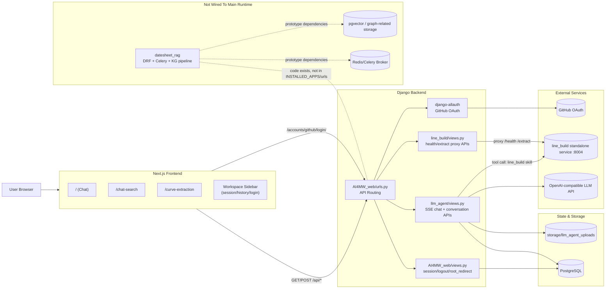
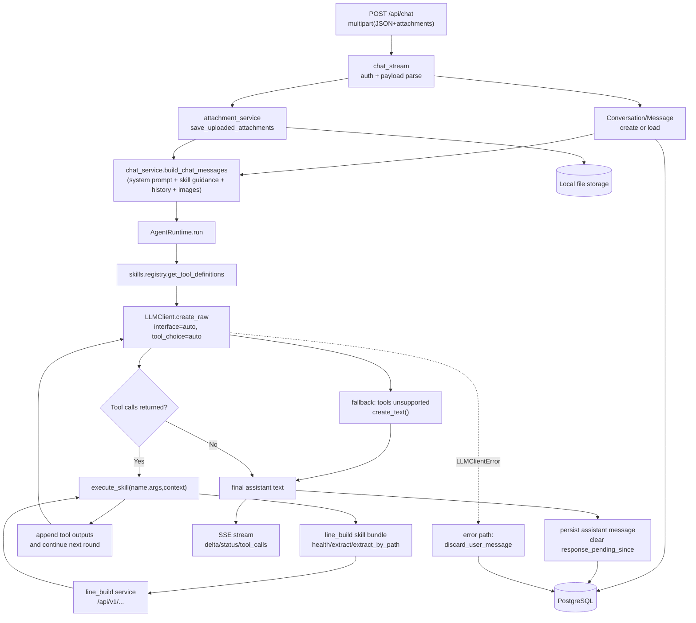

# AI4MW Web 架构分析（代码核验版）

> 本文基于当前仓库代码（`2026-03-25`）整理，重点区分“已接入主链路”和“仓库内存在但未接入主链路”的模块。

## 1. 当前项目结论（先看这个）

- 主运行链路是 `Next.js 前端 -> Django API -> PostgreSQL + 文件存储 + 外部服务`。
- 聊天能力由 `llm_agent` 承担，Agent 支持工具调用（当前只注册了 `line_build` skill）。
- 曲线提取有两条入口：
  - 前端工作台页面 `/curve-extraction` 走 Django `line_build` 代理接口。
  - 聊天 Agent 在需要时直接调用 `line_build` 独立服务。
- `datesheet_rag` 在仓库内有完整原型代码（DRF + Celery + KG），但当前未加入 Django 主应用启动链路。

## 2. 总体架构图（Current Runtime + Dormant Prototype）

## 3. Agent 架构图（llm_agent Runtime）

## 4. 关键模块职责（主链路）

| 模块 | 职责 | 说明 |
|---|---|---|
| `AI4MW_web` | Django 主配置与主路由 | 承接 `/api/*`、`/accounts/*`、根路径跳转 |
| `llm_agent` | 会话/消息模型、SSE 聊天、Agent 运行时、附件管理 | 聊天主业务核心 |
| `llm_agent/skills/line_build` | Tool 形式封装曲线提取能力 | 当前唯一注册 skill bundle |
| `line_build` | Django 到独立算法服务的代理层 | 前端工作台用它访问提取服务 |
| `frontend` | Next.js UI 与 API 调用层 | 已落地聊天、搜索、曲线提取页面 |
| `storage/llm_agent_uploads` | 聊天图片附件存储目录 | 保存并回放消息附件 |

## 5. `datesheet_rag` 的准确定位

- 有真实代码：任务模型、图谱模型、DRF ViewSet、Celery 多阶段流水线。
- 但当前不是主应用可用能力：
  - 未接入 `INSTALLED_APPS`。
  - 未接入 Django 主路由。
  - 依赖项（如 DRF/Celery/OpenAI/pgvector/docling）不在当前 `requirements.txt`。
  - 部分代码引用 `api.models.Device`，当前仓库无该模块。

## 6. 配置与运行时要点

- 后端与前端都采用“系统环境变量 > `.env` > `config.yaml`”的覆盖逻辑。
- `config.yaml` 在当前实现中按扁平 `KEY: value` 解析，不支持复杂 YAML 嵌套结构。
- 主数据库默认是 PostgreSQL，仓库中的 `db.sqlite3` 并非主路径默认值。
